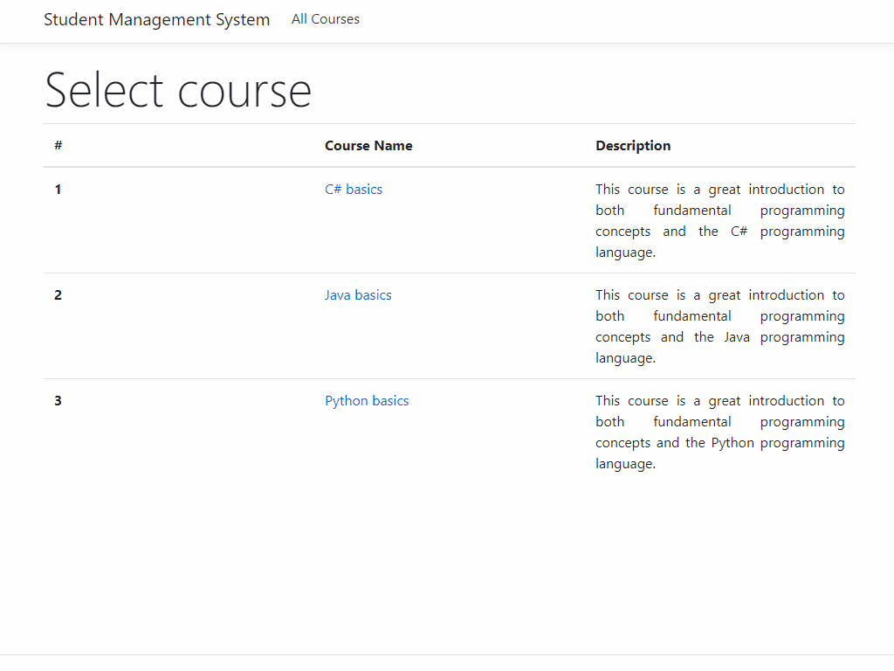

# student_management_system
A simple application that can be used for student records management. In theory, a possible end-user may be an organization such as a university, school, or educational course center.

# Description:

This application has the following architecture:

- Presentation layer: ASP.NET Core MVC (Razor, .NET Core);
- Business layer: Class Library (C#, .NET Core);
- Data layer: Local MS Server database (T-SQL).

There are some additional project details (architecture, technologies/patterns used, etc.):

- ASP.NET MVC UI (.NET Core);
- SQL database (relational tables, stored procedures);
- Dapper M-ORM (object-relational mapping);
- Linq (sorting, filtering, other);
- Dependency injection;
- Three-tier architecture;
- Unit Of Work pattern (IUOW);
- Repository pattern (IDataConnection);
- Identity Map pattern (IIdentityMap);
- View form input validation (ASP.NET Core DataAnnotations);
- Unit-tests with mocking (MS Test, Autofac.Extras.Moq, Moq).

# P.s.

Please note, that I've added database scripts. Just in case someone might want to play around with the application a little bit.

# Demo:

